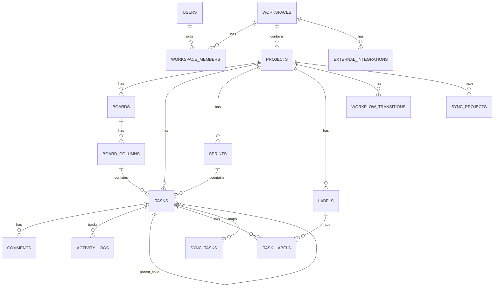

# System Design Document
# Hybrid Agile Task Management Platform with Trello-Jira Migration and Synchronization

## 1. Architecture Overview

The system follows a modular monolith architecture.

The backend is divided by business modules:

- Auth
- Workspace
- Project
- Board
- Task
- Comment
- Activity
- Agile
- Workflow
- Notification
- Report
- Integration
- Migration
- Sync

The frontend is a Next.js web application.

The database is PostgreSQL.

Redis is used for:
- WebSocket connection state
- Background job queue
- Idempotency keys
- Rate limit protection
- Temporary migration progress

## 2. High-Level Architecture

```text
Frontend Web App
   |
   | REST API / WebSocket
   v
FastAPI Backend
   |
   +-- PostgreSQL
   +-- Redis
   +-- Background Worker
   |
   +-- Trello API
   +-- Jira API
```

## 3. Backend Folder Structure

```text
app/
  main.py
  core/
    config.py
    database.py
    security.py
    redis.py
    websocket.py
    exceptions.py
  common/
    pagination.py
    enums.py
    dependencies.py
  modules/
    auth/
      models.py
      schemas.py
      repository.py
      service.py
      router.py
    workspace/
    project/
    board/
    task/
    comment/
    activity/
    agile/
    workflow/
    notification/
    report/
    integration/
    migration/
    sync/
```

## 4. ERD



## 5. Database Schema

### users

```sql
CREATE TABLE users (
    id UUID PRIMARY KEY,
    email VARCHAR(255) UNIQUE NOT NULL,
    password_hash TEXT NOT NULL,
    full_name VARCHAR(255) NOT NULL,
    avatar_url TEXT,
    is_active BOOLEAN DEFAULT TRUE,
    created_at TIMESTAMP NOT NULL,
    updated_at TIMESTAMP NOT NULL
);
```

### workspaces

```sql
CREATE TABLE workspaces (
    id UUID PRIMARY KEY,
    name VARCHAR(255) NOT NULL,
    description TEXT,
    owner_id UUID REFERENCES users(id),
    created_at TIMESTAMP NOT NULL,
    updated_at TIMESTAMP NOT NULL
);
```

### workspace_members

```sql
CREATE TABLE workspace_members (
    id UUID PRIMARY KEY,
    workspace_id UUID REFERENCES workspaces(id),
    user_id UUID REFERENCES users(id),
    role VARCHAR(50) NOT NULL,
    created_at TIMESTAMP NOT NULL,
    UNIQUE(workspace_id, user_id)
);
```

Roles:
- OWNER
- ADMIN
- MANAGER
- MEMBER
- VIEWER

### projects

```sql
CREATE TABLE projects (
    id UUID PRIMARY KEY,
    workspace_id UUID REFERENCES workspaces(id),
    name VARCHAR(255) NOT NULL,
    key VARCHAR(20) NOT NULL,
    description TEXT,
    created_by UUID REFERENCES users(id),
    created_at TIMESTAMP NOT NULL,
    updated_at TIMESTAMP NOT NULL,
    UNIQUE(workspace_id, key)
);
```

### boards

```sql
CREATE TABLE boards (
    id UUID PRIMARY KEY,
    project_id UUID REFERENCES projects(id),
    name VARCHAR(255) NOT NULL,
    type VARCHAR(50) NOT NULL,
    created_at TIMESTAMP NOT NULL,
    updated_at TIMESTAMP NOT NULL
);
```

Board type:
- KANBAN
- SCRUM

### board_columns

```sql
CREATE TABLE board_columns (
    id UUID PRIMARY KEY,
    board_id UUID REFERENCES boards(id),
    name VARCHAR(255) NOT NULL,
    status_key VARCHAR(100) NOT NULL,
    position INTEGER NOT NULL,
    is_done_column BOOLEAN DEFAULT FALSE,
    created_at TIMESTAMP NOT NULL,
    updated_at TIMESTAMP NOT NULL
);
```

### tasks

```sql
CREATE TABLE tasks (
    id UUID PRIMARY KEY,
    project_id UUID REFERENCES projects(id),
    board_id UUID REFERENCES boards(id),
    column_id UUID REFERENCES board_columns(id),
    sprint_id UUID NULL,
    epic_id UUID NULL,
    parent_task_id UUID NULL REFERENCES tasks(id),
    task_key VARCHAR(50) UNIQUE NOT NULL,
    title VARCHAR(500) NOT NULL,
    description TEXT,
    type VARCHAR(50) NOT NULL,
    priority VARCHAR(50) NOT NULL,
    status VARCHAR(100) NOT NULL,
    assignee_id UUID NULL REFERENCES users(id),
    reporter_id UUID REFERENCES users(id),
    story_point INTEGER,
    due_date TIMESTAMP,
    position INTEGER DEFAULT 0,
    created_at TIMESTAMP NOT NULL,
    updated_at TIMESTAMP NOT NULL,
    completed_at TIMESTAMP NULL
);
```

Task type:
- EPIC
- STORY
- TASK
- BUG
- SUBTASK

Priority:
- LOW
- MEDIUM
- HIGH
- URGENT

### sprints

```sql
CREATE TABLE sprints (
    id UUID PRIMARY KEY,
    project_id UUID REFERENCES projects(id),
    name VARCHAR(255) NOT NULL,
    goal TEXT,
    status VARCHAR(50) NOT NULL,
    start_date TIMESTAMP,
    end_date TIMESTAMP,
    created_at TIMESTAMP NOT NULL,
    updated_at TIMESTAMP NOT NULL
);
```

Sprint status:
- PLANNED
- ACTIVE
- COMPLETED

### comments

```sql
CREATE TABLE comments (
    id UUID PRIMARY KEY,
    task_id UUID REFERENCES tasks(id),
    user_id UUID REFERENCES users(id),
    content TEXT NOT NULL,
    created_at TIMESTAMP NOT NULL,
    updated_at TIMESTAMP NOT NULL
);
```

### labels

```sql
CREATE TABLE labels (
    id UUID PRIMARY KEY,
    project_id UUID REFERENCES projects(id),
    name VARCHAR(100) NOT NULL,
    color VARCHAR(30),
    created_at TIMESTAMP NOT NULL
);
```

### task_labels

```sql
CREATE TABLE task_labels (
    task_id UUID REFERENCES tasks(id),
    label_id UUID REFERENCES labels(id),
    PRIMARY KEY(task_id, label_id)
);
```

### activity_logs

```sql
CREATE TABLE activity_logs (
    id UUID PRIMARY KEY,
    workspace_id UUID REFERENCES workspaces(id),
    project_id UUID REFERENCES projects(id),
    task_id UUID NULL REFERENCES tasks(id),
    actor_id UUID REFERENCES users(id),
    action VARCHAR(100) NOT NULL,
    old_value JSONB,
    new_value JSONB,
    created_at TIMESTAMP NOT NULL
);
```

### notifications

```sql
CREATE TABLE notifications (
    id UUID PRIMARY KEY,
    user_id UUID REFERENCES users(id),
    type VARCHAR(100) NOT NULL,
    title VARCHAR(255) NOT NULL,
    content TEXT,
    is_read BOOLEAN DEFAULT FALSE,
    metadata JSONB,
    created_at TIMESTAMP NOT NULL
);
```

### workflow_transitions

```sql
CREATE TABLE workflow_transitions (
    id UUID PRIMARY KEY,
    project_id UUID REFERENCES projects(id),
    from_status VARCHAR(100) NOT NULL,
    to_status VARCHAR(100) NOT NULL,
    role_required VARCHAR(50),
    created_at TIMESTAMP NOT NULL,
    UNIQUE(project_id, from_status, to_status)
);
```

### external_integrations

```sql
CREATE TABLE external_integrations (
    id UUID PRIMARY KEY,
    workspace_id UUID REFERENCES workspaces(id),
    provider VARCHAR(50) NOT NULL,
    account_id VARCHAR(255),
    account_name VARCHAR(255),
    access_token_encrypted TEXT NOT NULL,
    refresh_token_encrypted TEXT,
    metadata JSONB,
    created_at TIMESTAMP NOT NULL,
    updated_at TIMESTAMP NOT NULL
);
```

Provider:
- TRELLO
- JIRA

### sync_projects

```sql
CREATE TABLE sync_projects (
    id UUID PRIMARY KEY,
    workspace_id UUID REFERENCES workspaces(id),
    internal_project_id UUID REFERENCES projects(id),
    trello_board_id VARCHAR(255),
    jira_project_id VARCHAR(255),
    jira_project_key VARCHAR(50),
    sync_mode VARCHAR(50) NOT NULL,
    created_at TIMESTAMP NOT NULL,
    updated_at TIMESTAMP NOT NULL
);
```

Sync mode:
- IMPORT_ONLY
- ONE_WAY_TRELLO_TO_JIRA
- ONE_WAY_JIRA_TO_TRELLO
- BIDIRECTIONAL

### sync_tasks

```sql
CREATE TABLE sync_tasks (
    id UUID PRIMARY KEY,
    sync_project_id UUID REFERENCES sync_projects(id),
    internal_task_id UUID REFERENCES tasks(id),
    trello_card_id VARCHAR(255),
    jira_issue_id VARCHAR(255),
    jira_issue_key VARCHAR(50),
    last_synced_at TIMESTAMP,
    last_source VARCHAR(50),
    created_at TIMESTAMP NOT NULL,
    updated_at TIMESTAMP NOT NULL
);
```

### sync_comments

```sql
CREATE TABLE sync_comments (
    id UUID PRIMARY KEY,
    sync_task_id UUID REFERENCES sync_tasks(id),
    internal_comment_id UUID REFERENCES comments(id),
    trello_comment_id VARCHAR(255),
    jira_comment_id VARCHAR(255),
    created_at TIMESTAMP NOT NULL
);
```

### sync_logs

```sql
CREATE TABLE sync_logs (
    id UUID PRIMARY KEY,
    sync_project_id UUID REFERENCES sync_projects(id),
    sync_task_id UUID NULL REFERENCES sync_tasks(id),
    provider VARCHAR(50),
    event_type VARCHAR(100),
    status VARCHAR(50),
    request_payload JSONB,
    response_payload JSONB,
    error_message TEXT,
    created_at TIMESTAMP NOT NULL
);
```

## 6. API Contract

### Auth

#### POST /auth/register

Request:
```json
{
  "email": "user@example.com",
  "password": "password123",
  "full_name": "Nguyen Van A"
}
```

Response:
```json
{
  "id": "uuid",
  "email": "user@example.com",
  "full_name": "Nguyen Van A"
}
```

#### POST /auth/login

Request:
```json
{
  "email": "user@example.com",
  "password": "password123"
}
```

Response:
```json
{
  "access_token": "jwt",
  "refresh_token": "jwt",
  "token_type": "bearer"
}
```

### Workspace

#### POST /workspaces

Request:
```json
{
  "name": "Sota Labs",
  "description": "Main workspace"
}
```

Response:
```json
{
  "id": "uuid",
  "name": "Sota Labs",
  "role": "OWNER"
}
```

#### GET /workspaces

Response:
```json
{
  "items": [
    {
      "id": "uuid",
      "name": "Sota Labs",
      "role": "OWNER"
    }
  ]
}
```

### Project

#### POST /workspaces/{workspace_id}/projects

Request:
```json
{
  "name": "Graduation Project",
  "key": "GDP",
  "description": "Hybrid task management system"
}
```

Response:
```json
{
  "id": "uuid",
  "name": "Graduation Project",
  "key": "GDP"
}
```

### Board

#### GET /boards/{board_id}

Response:
```json
{
  "id": "uuid",
  "name": "Main Board",
  "columns": [
    {
      "id": "uuid",
      "name": "Todo",
      "position": 1,
      "tasks": []
    }
  ]
}
```

#### PATCH /tasks/{task_id}/move

Request:
```json
{
  "target_column_id": "uuid",
  "target_position": 2
}
```

Response:
```json
{
  "id": "uuid",
  "column_id": "uuid",
  "position": 2
}
```

### Task

#### POST /projects/{project_id}/tasks

Request:
```json
{
  "title": "Create login API",
  "description": "Implement JWT auth",
  "type": "TASK",
  "priority": "HIGH",
  "column_id": "uuid",
  "assignee_id": "uuid",
  "due_date": "2026-07-15T00:00:00Z"
}
```

Response:
```json
{
  "id": "uuid",
  "task_key": "GDP-1",
  "title": "Create login API",
  "status": "TODO"
}
```

### Sprint

#### POST /projects/{project_id}/sprints

Request:
```json
{
  "name": "Sprint 1",
  "goal": "Finish MVP foundation",
  "start_date": "2026-07-01T00:00:00Z",
  "end_date": "2026-07-14T00:00:00Z"
}
```

Response:
```json
{
  "id": "uuid",
  "name": "Sprint 1",
  "status": "PLANNED"
}
```

#### POST /sprints/{sprint_id}/start

Response:
```json
{
  "id": "uuid",
  "status": "ACTIVE"
}
```

### Trello Integration

#### POST /integrations/trello/connect

Request:
```json
{
  "access_token": "trello_token",
  "account_name": "Phong Trello"
}
```

Response:
```json
{
  "id": "uuid",
  "provider": "TRELLO",
  "status": "CONNECTED"
}
```

#### GET /integrations/trello/boards

Response:
```json
{
  "items": [
    {
      "id": "trello_board_id",
      "name": "Team Board"
    }
  ]
}
```

#### POST /migrations/trello/import/preview

Request:
```json
{
  "workspace_id": "uuid",
  "trello_board_id": "trello_board_id"
}
```

Response:
```json
{
  "board_name": "Team Board",
  "lists_count": 4,
  "cards_count": 50,
  "labels_count": 8,
  "checklists_count": 20,
  "comments_count": 120
}
```

#### POST /migrations/trello/import

Request:
```json
{
  "workspace_id": "uuid",
  "trello_board_id": "trello_board_id",
  "project_name": "Imported Trello Project"
}
```

Response:
```json
{
  "migration_id": "uuid",
  "status": "PROCESSING"
}
```

### Jira Integration

#### POST /integrations/jira/connect

Request:
```json
{
  "site_url": "https://example.atlassian.net",
  "email": "user@example.com",
  "api_token": "jira_token"
}
```

Response:
```json
{
  "id": "uuid",
  "provider": "JIRA",
  "status": "CONNECTED"
}
```

#### GET /integrations/jira/projects

Response:
```json
{
  "items": [
    {
      "id": "10001",
      "key": "GDP",
      "name": "Graduation Project"
    }
  ]
}
```

#### POST /migrations/jira/export

Request:
```json
{
  "internal_project_id": "uuid",
  "jira_project_id": "10001",
  "status_mapping": {
    "TODO": "To Do",
    "IN_PROGRESS": "In Progress",
    "DONE": "Done"
  }
}
```

Response:
```json
{
  "migration_id": "uuid",
  "status": "PROCESSING"
}
```

## 7. WebSocket Events

### Connection

Endpoint:
```text
/ws/projects/{project_id}
```

Authentication:
```text
JWT token passed as query parameter or Authorization header
```

### Event: task.created

```json
{
  "event": "task.created",
  "project_id": "uuid",
  "payload": {
    "task_id": "uuid",
    "title": "Create login API",
    "column_id": "uuid"
  }
}
```

### Event: task.updated

```json
{
  "event": "task.updated",
  "project_id": "uuid",
  "payload": {
    "task_id": "uuid",
    "changed_fields": ["title", "priority"]
  }
}
```

### Event: task.moved

```json
{
  "event": "task.moved",
  "project_id": "uuid",
  "payload": {
    "task_id": "uuid",
    "from_column_id": "uuid",
    "to_column_id": "uuid",
    "position": 2
  }
}
```

### Event: comment.created

```json
{
  "event": "comment.created",
  "project_id": "uuid",
  "payload": {
    "task_id": "uuid",
    "comment_id": "uuid"
  }
}
```

### Event: notification.created

```json
{
  "event": "notification.created",
  "user_id": "uuid",
  "payload": {
    "notification_id": "uuid",
    "title": "You were assigned a task"
  }
}
```

## 8. Trello/Jira Mapping

| Trello | Internal Platform | Jira |
|---|---|---|
| Board | Project | Project |
| List | Board Column / Status | Status |
| Card | Task | Issue |
| Checklist | Subtask | Sub-task |
| Label | Label | Label |
| Member | User / Assignee | Assignee |
| Due Date | Due Date | Due Date |
| Comment | Comment | Comment |
| Attachment | Attachment metadata | Attachment |
| Card Description | Task Description | Issue Description |

## 9. Conflict Resolution

### Conflict Scenario

A Trello card and Jira issue are updated before synchronization completes.

### Supported Strategies

1. Last write wins
2. Trello priority
3. Jira priority
4. Manual resolution

### Conflict Record

```json
{
  "sync_task_id": "uuid",
  "field": "description",
  "trello_value": "old text",
  "jira_value": "new text",
  "detected_at": "2026-07-01T12:00:00Z",
  "resolution": "PENDING"
}
```

## 10. Background Jobs

Required jobs:

- import_trello_board_job
- export_project_to_jira_job
- sync_trello_event_job
- sync_jira_event_job
- retry_failed_sync_job
- cleanup_expired_websocket_state_job

## 11. Deployment Design

```text
Docker Compose:
- frontend
- backend
- postgres
- redis
- worker
- nginx
```

## 12. Security Design

- JWT for app auth
- Encrypted external tokens
- RBAC for workspace/project actions
- Webhook verification where possible
- API rate limiting
- Audit log for important actions
