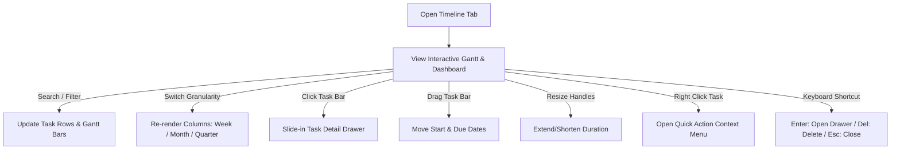

# Timeline Product Specification & Interaction Design (IxD)

This document outlines the product design specification, Information Architecture (IA), Interaction Design (IxD), and Micro-interactions for the **Timeline Tab** (`/workspaces/[workspaceId]/plans/[planId]/timeline`).

---

## 1. Product & Layout Overview

The Timeline view is an interactive Gantt & Velocity Planning chart designed for project managers, tech leads, and developers to visualize dependencies, work item schedules, member workloads, and sprint milestones.

### Layout Hierarchy
1. **Header Control Bar**:
   - Search input, Calendar picker, Date range navigator (`Jul 6 – Aug 2, 2026`).
   - Filter dropdown, View settings, `Today` jumper button, Granularity switcher (`Week` | `Month` | `Quarter`).
2. **Timeline Split Grid**:
   - **Left Tree Table (320px)**: Collapsible group headers (`dfsafas (10 items)`), task rows with issue key, type icon, title, assignee avatar, and status dropdown pill.
   - **Right Gantt Canvas**: Synchronized timeline columns with week headers (`W28`, `W29`, `W30`), vertical `Today` indicator line, and interactive task bars.
3. **Gantt Task Bars**:
   - Color-coded status bars (Blue for In Progress, Purple for Code Review, Green for Done, Gray for To Do).
   - Date range label inside/above bar (`Jul 5 - Jul 16`), % completion pill badge on right end (`60%`).
   - Drag handles on both ends for duration resizing.
4. **Bottom Metrics & Workload Dashboard**:
   - `Progress Overview`: Donut chart showing 35% completed.
   - `Work items by status`: Distribution legend breakdown.
   - `Workload balance`: Capacity progress bars per team member.
   - `Milestones`: Sprint goal tracker (`Jul 20, 2026 - 60%`) + `+ Add milestone` button.
5. **Footer Bar**:
   - Row counter (`Showing 1-10 of 10 items`), Rows per page selector (`25`), and Pagination controls (`< 1 >`).

---

## 2. Interaction Design (IxD) Flow

### User Actions & Flow
1. **Entry**: User navigates to Timeline $\rightarrow$ Auto-scrolls to the `Today` vertical indicator line.
2. **Task Inspection**: Double click or single click task row/bar $\rightarrow$ Drawer slides in from right (`translateX(24px -> 0)` in 220ms).
3. **Rescheduling**: Click and drag task bar horizontally $\rightarrow$ Updates `startDate` and `dueDate` with instant snap and toast confirmation.
4. **Duration Adjustment**: Drag left or right handle of task bar $\rightarrow$ Extends/shortens duration live.
5. **Contextual Menu**: Right-click task bar $\rightarrow$ Opens popover menu for status change, assignee update, duplication, or deletion.

---

## 3. Micro-interactions Specification

| State / Trigger | Target Component | Visual & Motion Response |
| :--- | :--- | :--- |
| **Hover** | Task Bar | Elevation +1, shadow `0 4px 12px rgba(0,0,0,0.08)`, border Primary 200, cursor `pointer`. Rich tooltip appears after 120ms. |
| **Active / Click** | Task Bar | Ripple effect, pressed state, slides open Task Drawer from right in 220ms. |
| **Drag** | Task Bar | Cursor `grabbing`, opacity `75%`, ghost shadow, date column highlight. On drop: snap animation, soft bounce, sonner toast feedback (`"Task rescheduled"`). |
| **Resize** | Handle (Left/Right) | Cursor `ew-resize`, handle turns solid blue, live date tooltip updates in real-time. |
| **Collapse / Expand** | Epic Header (`▼`) | Chevron rotates `90°`, child task rows slide up/down smoothly. |
| **Context Menu** | Task Bar (Right-click) | Popover fades & scales in (`opacity 0 -> 1`, `scale 0.96 -> 1` in 120ms). |
| **Keyboard** | Shortcut | `Enter` opens drawer, `Delete` removes item, `Esc` closes drawer/menus. |

---

## 4. Accessibility & States

- **Keyboard Navigation**: Full keyboard navigation across tree table and gantt grid using Arrow keys, `Enter`, `Delete`, `Esc`.
- **Empty State**: Clean illustrated empty state when 0 tasks exist (`○ No work items found - Add your first work item`).
- **Loading State**: Skeleton shimmer for left table rows and gantt bars during query fetch.
